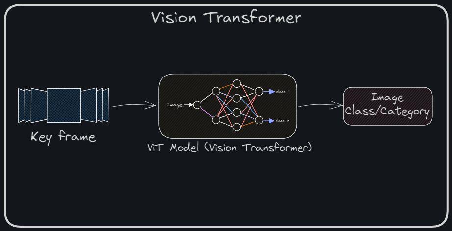

# Vision Transformer (ViT) MicroService  
**Part of the Video Search Engine Project**  

This repository contains a Flask-based web service that leverages a Vision Transformer (ViT) model for classifying video keyframes into predefined categories. The service plays a crucial role in enhancing multimedia search by enabling accurate tagging and indexing of keyframes extracted from videos.  



## Functionality  
- Accepts keyframes extracted from videos as input.  
- Utilizes a pre-trained Vision Transformer (ViT) model to classify images into predefined categories, such as ImageNet classes.  
- Returns classification results with associated categories, IDs, and frame identifiers.  
- Supports integration with other microservices for seamless video processing.  

## Key Features  
- **Advanced Image Classification**: Uses a state-of-the-art Vision Transformer model to ensure high-accuracy classification of video keyframes.  
- **REST API Integration**: Provides endpoints for video keyframe classification and indexing.  
- **Flexible Modes**: Supports various operation modes (`standalone`, `db`) for dynamic workflows.  
- **Detailed API Response**: Returns comprehensive JSON responses containing classification results, including categories, category IDs, and frame IDs.  
- **Integration Ready**: Easily integrates with the broader Video Search Engine system.  


## Installation

### Prerequisites
- **Python**: Version `3.12` 
- **MySQL server:** With predefined table structure (`MYSQL_DUMP.sql`) loaded (only for db mode)
- The service runs on port `5002`, ensure no other services are using this port before running the application. 

### Steps  

1. Clone the repository:  
    ```bash  
    git clone https://github.com/iam-VK/Vision_Transformer_service 
    cd Vision_Transformer_service
    ```  

2. Install the dependencies:  
    ```bash
    ./setup.sh
    ```  
3. Setup model:
    ```bash
    ./setup_model.sh
4. Run the Flask application:  
    ```bash  
    ./run.sh
    ```  

5. The service will be available at `http://0.0.0.0:5002`.  

## Endpoints  

### 1. Service Status  
- **URL**: `/`  
- **Method**: GET or POST  
- **Description**: Returns the status of the service along with available endpoints.  
- **Response**:  
    ```json  
    {  
        "status": "Alive",  
        "endpoints": {  
            "/video-index": {  
                "method": "POST",  
                "parameters": {  
                    "vid_name": "vid_name",  
                    "file_upload": "video file",  
                    "mode": "standalone, db(default)"  
                }  
            }  
        }  
    }  
    ```  

### 2. Video Keyframe Indexing  
- **URL**: `/video-index`  
- **Method**: POST  
- **Request Parameters**:  
    - `vid_name`: Name of the video file.  
    - `file_upload`: Video file to be processed.  
    - `mode` (optional):  
        - `standalone`: Processes keyframes independently.  
        - `db` (default): Processes and saves results to the database.

- **Response**:
    ```json  
    {  
        "Acknowledgement": "File received",  
        "ViT-Result": {  
            "keyframes_classified": {  
                "0": {  
                    "category": "<list of categories>",  
                    "category_id": "<category_id>",
                    "frame_id": "<frame_id>"  
                },
                ...  
            }  
        }  
    }  
    ```  

## Benefits  

- **Efficient Multimedia Search**: Enables accurate tagging of video content for improved search capabilities.  
- **Seamless Integration**: Functions as a modular service in the Video Search Engine project.  
- **Customizable Workflows**: Supports different operational modes to fit varying use cases.  

---

This service is an integral part of the Video Search Engine project, enhancing the system's capability to process, classify, and retrieve multimedia content accurately and efficiently.